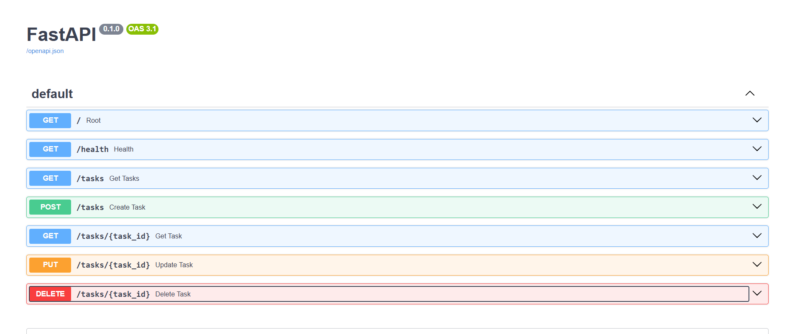

# Task API

A small CRUD API for managing a to-do list, built with **FastAPI** and **Python**.
Tasks are stored **in memory** (no database yet) — restarting the server resets the data back to the 3 example tasks.

Built as part of Week 2 — Assignment 1 ("Build your first CRUD API").

## What this is

This API lets a client **create, read, update, and delete** tasks (CRUD), using the standard HTTP methods:

| Operation | Method | Endpoint |
|---|---|---|
| Create | POST | `/tasks` |
| Read (all) | GET | `/tasks` |
| Read (one) | GET | `/tasks/{id}` |
| Update | PUT | `/tasks/{id}` |
| Delete | DELETE | `/tasks/{id}` |

It also includes a root endpoint (`/`), a health check (`/health`), and interactive documentation via Swagger UI (`/docs`).

## How to install & run

```bash
python -m venv venv
venv\Scripts\activate        # Windows
# source venv/bin/activate   # macOS/Linux

pip install -r requirements.txt
python -m uvicorn main:app --reload
```

The server starts at `http://127.0.0.1:8000`.

## Endpoints

| Method | Path | Description | Success | Errors |
|---|---|---|---|---|
| GET | `/` | API info | 200 | — |
| GET | `/health` | Health check | 200 | — |
| GET | `/tasks` | List all tasks | 200 | — |
| POST | `/tasks` | Create a new task | 201 | 400 if title missing/empty |
| GET | `/tasks/{id}` | Get one task | 200 | 404 if not found |
| PUT | `/tasks/{id}` | Update a task | 200 | 400 invalid body · 404 if not found |
| DELETE | `/tasks/{id}` | Delete a task | 204 | 404 if not found |

## Example — curl

```bash
curl -i -X POST http://127.0.0.1:8000/tasks -H "Content-Type: application/json" -d '{"title":"Buy milk"}'
```

```
HTTP/1.1 201 Created
content-type: application/json

{"id":4,"title":"Buy milk","done":false}
```

## Swagger UI

Interactive docs are available at `http://127.0.0.1:8000/docs`, where every endpoint can be tried out directly from the browser.



## The mortality experiment

Since tasks are stored in memory (a plain Python list), restarting the server resets the task list back to the original 3 example tasks — anything created, updated, or deleted during a session is lost. This happens because the data lives only in the running program's memory, not on disk. It's the reason a real database is needed for anything that must survive a restart — which is exactly what next week's assignment covers.
